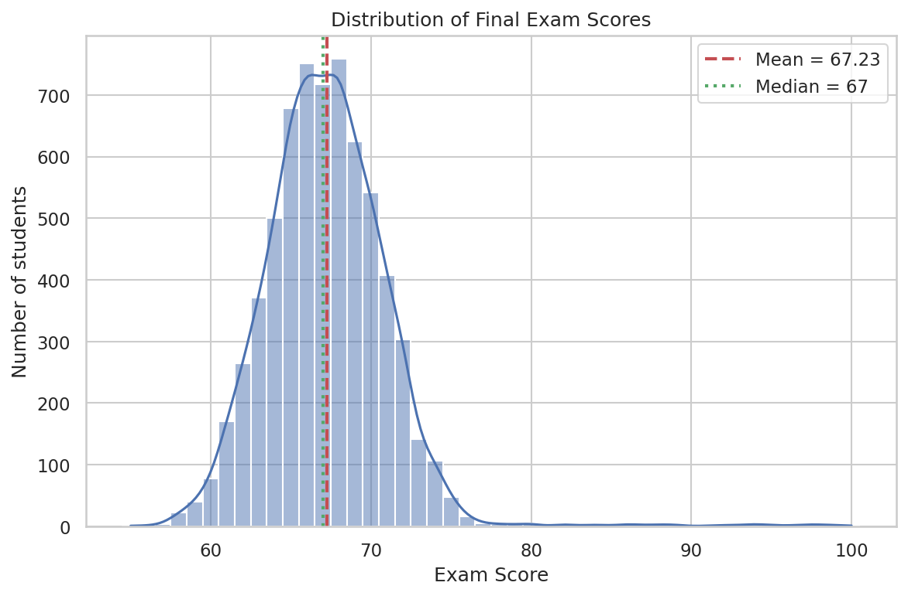
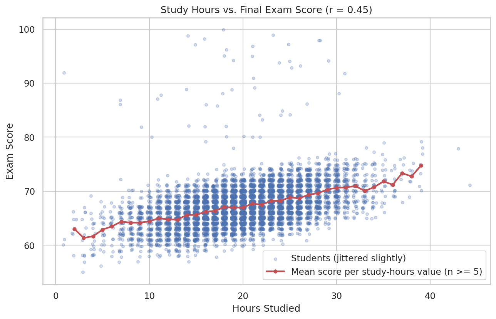
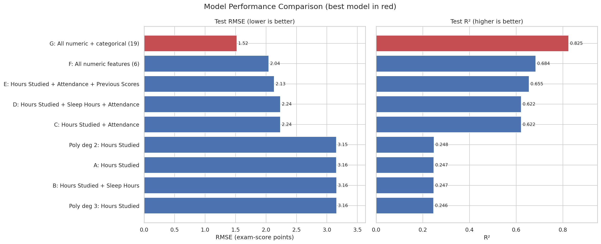

# Student Exam Score Prediction Using Regression

Predicting students' final exam scores from study hours and other student factors with **Linear Regression** and **Polynomial Regression** (Python, scikit-learn). Built as a Machine Learning / Data Science internship task (CodeAlpha).

## Overview

The goal is to predict `Exam_Score` mainly from `Hours_Studied`, then test whether other features (sleep, attendance, previous scores, tutoring, and background variables) make the predictions better. The project follows a full workflow: inspect the data, clean it, explore it, split it, fit a baseline, try polynomial curves, compare feature combinations, and analyse the errors. All headline metrics in this README (MAE, MSE, RMSE, R²) come from the **held-out test set** (20% of the students); training and cross-validation figures are labelled as such. Everything was produced by `analysis/student_score_prediction.py`.

**Short version of the result:** study hours alone explain about a quarter of the variation in exam scores (R² = 0.247). The relationship is essentially a straight line, so polynomial curves do not help. The biggest single improvement comes from adding attendance, and the best model uses all available features (R² = 0.825, MAE = 0.415 points).

## Dataset

| | |
|---|---|
| Source file | `data/student_scores_original.csv` (the file supplied with the task, unchanged) |
| Observations | 6,607 students (6,606 after cleaning) |
| Columns | 20 (7 numeric including the target, 13 categorical) |
| Target | `Exam_Score` (integer, range 55–100, mean 67.23, SD 3.87) |
| Main feature | `Hours_Studied` (range 1–44, mean 19.97, SD 5.99; the unit is not documented, probably hours per week) |
| Other numeric features | `Attendance`, `Sleep_Hours`, `Previous_Scores`, `Tutoring_Sessions`, `Physical_Activity` |
| Categorical features | `Parental_Involvement`, `Access_to_Resources`, `Extracurricular_Activities`, `Motivation_Level`, `Internet_Access`, `Family_Income`, `Teacher_Quality`, `School_Type`, `Peer_Influence`, `Learning_Disabilities`, `Parental_Education_Level`, `Distance_from_Home`, `Gender` |

The dataset has **no "participation" column**. Wherever the task suggested "Study Hours + Participation", `Attendance` is used as the closest engagement measure and labelled as such.

## Data Cleaning

| Check | Finding | Decision |
|---|---|---|
| Duplicate rows | 0 | nothing to remove |
| Data types | all correct | none converted |
| Inconsistent category spellings | none found | none needed |
| Missing values | `Teacher_Quality` (78), `Parental_Education_Level` (90), `Distance_from_Home` (67) | labelled `Unknown` (keeps the rows and uses no statistics from the data, so nothing can leak from test to train) |
| Impossible values | one `Exam_Score` = 101 (above the 0–100 scale) | row removed: the true score is unknown and one row is negligible |
| Negative / out-of-range hours, attendance, sleep, scores | none | – |
| Outliers (1.5×IQR rule) | 103 unusual `Exam_Score` values (1.56%), 43 extreme `Hours_Studied` values | **retained** (see below) |

**Why the outliers were kept.** All flagged values are inside the valid range, so none is provably an error. The students with unusually high or low scores have ordinary study hours, attendance and previous scores (no feature differs by more than 0.31 standard deviations), so the recorded data does not explain them, but that is not evidence they are mistakes. Deleting rows because a model predicts them badly would be circular and would make the results look better than they are. Instead, section 11.3 of the script measures exactly how much of the error they cause (see *Key Findings*). The cleaned file is `data/student_scores_cleaned.csv` (6,606 rows).

## Exploratory Data Analysis

- **Scores are tightly bunched** (SD ≈ 3.9 points) with a long tail of high scorers: mean 67.23, median 67.
- **Study hours vs. score:** r = 0.45. Students who study 10 hours or fewer average 63.97 points (n = 365); those above 30 hours average 71.01 (n = 253). The average rises steadily and roughly in a straight line.
- **Strongest numeric correlations with the score:** `Attendance` 0.58, `Hours_Studied` 0.45, `Previous_Scores` 0.17, `Tutoring_Sessions` 0.15. `Physical_Activity` (0.03) and `Sleep_Hours` (-0.02) are close to zero.
- **Categorical differences are small but consistent:** the largest gaps between groups are `Access_to_Resources` (1.89 points; High 68.09 vs Low 66.20) and `Parental_Involvement` (1.76 points). `Gender` (0.00) and `School_Type` (0.08) show almost no difference.
- The numeric predictors are almost uncorrelated with each other (largest pair: 0.02), so their coefficients are stable.

| Score distribution | Study hours vs. score |
|---|---|
|  |  |

Correlation heatmap: `charts/correlation_heatmap.png`. More: `study_hours_distribution.png`, `numeric_features_vs_score.png`, `categorical_features_vs_score.png`, `outlier_boxplots.png`.

## Models

All models use the **same 80/20 split** (5,284 training / 1,322 test students, `random_state=42`). Imputation, scaling, polynomial expansion and one-hot encoding are inside scikit-learn `Pipeline`s, so they are fitted on the training rows only (no data leakage). Besides the required test-set metrics, each model also gets a 5-fold cross-validation on the training data as a second opinion.

**Linear Regression (baseline, Model A).** `Exam_Score` ~ `Hours_Studied`. Fitted equation: `Exam_Score = 61.546 + 0.2857 × Hours_Studied`, so each extra study-hour is associated with about 0.29 extra points.

**Polynomial Regression.** Degree 2 and degree 3 on `Hours_Studied` only (higher degrees were deliberately not tried because they overfit easily). Features are standardised inside the pipeline.

**Feature-combination experiments (Linear Regression).**

| Model | Features | Note |
|---|---|---|
| A | Study Hours | baseline |
| B | Study Hours + Sleep | |
| C | Study Hours + Attendance | Attendance used because there is no participation column |
| D | Study Hours + Sleep + Attendance | |
| E | Study Hours + Attendance + Previous Scores | extra |
| F | All 6 numeric features | the task's "all relevant numerical features" |
| G | All numeric + 13 categorical features (one-hot encoded, 19 features) | extra |

## Evaluation Metrics

- **MAE** (mean absolute error): the average size of a miss, in exam-score points. Easy to interpret.
- **MSE** (mean squared error): the average squared miss; it punishes big misses much more than small ones.
- **RMSE** (root mean squared error): the square root of MSE, back in score points. Comparing it with MAE shows whether a few large errors dominate.
- **R²**: the share of the variation in exam scores the model explains (0 = no better than always guessing the mean, 1 = perfect).

## Model Comparison

All values are test-set metrics; `CV R²` is 5-fold cross-validation on the training data only. Full table: `reports/model_comparison.csv`.

| Model | Features | Degree | MAE | MSE | RMSE | R² | CV R² (train) |
|---|---|--:|--:|--:|--:|--:|--:|
| A · Linear Regression | Hours Studied | 1 | 2.419 | 9.960 | 3.156 | 0.247 | 0.192 |
| Polynomial Regression | Hours Studied | 2 | 2.415 | 9.946 | 3.154 | 0.248 | 0.191 |
| Polynomial Regression | Hours Studied | 3 | 2.417 | 9.971 | 3.158 | 0.246 | 0.191 |
| B · Linear Regression | Hours Studied + Sleep Hours | 1 | 2.422 | 9.964 | 3.157 | 0.247 | 0.192 |
| C · Linear Regression | Hours Studied + Attendance | 1 | 1.430 | 5.003 | 2.237 | 0.622 | 0.534 |
| D · Linear Regression | Hours Studied + Sleep Hours + Attendance | 1 | 1.429 | 4.998 | 2.236 | 0.622 | 0.534 |
| E · Linear Regression | Hours Studied + Attendance + Previous Scores | 1 | 1.330 | 4.556 | 2.135 | 0.655 | 0.563 |
| F · Linear Regression | All numeric features (6) | 1 | 1.244 | 4.175 | 2.043 | 0.684 | 0.587 |
| G · Linear Regression ⭐ | All numeric + categorical (19) | 1 | 0.415 | 2.313 | 1.521 | 0.825 | 0.717 |



Polynomial curves vs. the straight line: `charts/polynomial_regression.png`. Overfitting check: `charts/train_vs_test_r2.png`. Actual vs. predicted: `charts/actual_vs_predicted.png`. Residuals: `charts/residual_plot.png`.

**Coefficients** (standardised: points per +1 SD of the feature, so sizes are comparable):

- Numeric-only model F: `Attendance` +2.28, `Hours_Studied` +1.72, `Previous_Scores` +0.70, `Tutoring_Sessions` +0.60, `Physical_Activity` +0.13, `Sleep_Hours` -0.03 (the only negative one, and practically zero).
- Full model G: after `Attendance` and `Hours_Studied`, the largest effects are categories with fewer resources or less support: `Access_to_Resources_Low` -2.09 and `Parental_Involvement_Low` -2.02 points versus the "High" group. `Gender_Male` (-0.01), `School_Type_Public` (+0.003) and `Sleep_Hours` (-0.01) contribute almost nothing.
- A coefficient is the estimated relationship **holding the other included variables constant**. It is not proof of cause and effect.

## Error Analysis

Residual = actual − predicted (test set).

- **Baseline (hours only):** MAE 2.42, RMSE 3.16. It **over-predicts low scorers and under-predicts high scorers** (mean error -3.48 for actual scores 55–64 and +3.96 for 71–98; partly the usual regression-to-the-mean effect). Its residuals correlate 0.71 with `Attendance`, a clear sign that important information is missing from the model.
- **Best model (G):** MAE 0.41, RMSE 1.52. 98.8% of test students are predicted within ±1 point. The typical student is over-predicted very slightly (median error about −0.2), most likely because the few extreme high scorers pull the fitted intercept up.
- **A handful of students dominate the error.** 5 test students (0.38%) are missed by more than 5 points, and they account for 93.0% of model G's total squared error. Without them the RMSE would be 0.40 and the MAE 0.33. (Diagnostic only: they are **not** removed from any reported metric.)
- **Underfitting:** the hours-only models fit poorly on both training (R² 0.189) and test data (0.247), and the cause is missing features, not model flexibility.
- **Overfitting:** none detected. Test R² is *higher* than training R² for all 9 models, and degree-3 does no better than degree-2.
- **Non-linearity:** not supported. The mean score per study-hour value lies along a straight line and polynomial fits change RMSE by less than 0.1%.

## Key Findings

1. **Study hours matter, but only modestly on their own.** Correlation with the score is 0.45; each extra hour is associated with about 0.29 points. Hours alone give test R² = 0.247, RMSE = 3.16, MAE = 2.42 points.
2. **The relationship is linear.** Degree 2 (R² 0.248, RMSE 3.154) and degree 3 (R² 0.246, RMSE 3.158) are practically identical to the linear baseline (RMSE 3.156), so the extra complexity is not justified.
3. **Sleep does not improve predictions.** Adding `Sleep_Hours` leaves R² unchanged (0.247 → 0.247), its correlation with the score is -0.02 and its coefficient is about zero.
4. **Attendance is the strongest single addition.** Study Hours + Attendance raises R² from 0.247 to 0.622 and cuts RMSE by 29% (to 2.24). (The dataset has no participation column, so participation could not be tested.)
5. **More features keep helping.** Adding previous scores gives R² 0.655; all six numeric features 0.684; adding the categorical background variables gives the best result, R² 0.825, RMSE 1.52, MAE 0.41 (best on the test set *and* in cross-validation). Resource access and parental involvement carry the largest categorical effects.
6. **Very few students account for most of the remaining error, and the test R² is likely optimistic.** 44 of 5,284 training students (0.83%) but only 5 of 1,322 test students (0.38%) are missed by more than 5 points. This split happened to contain fewer of them, which is why test R² (0.825) is above training R² (0.711). The cross-validated R² (0.717) is the more cautious estimate of performance on new students.
7. **No overfitting; the simple models underfit.** Test R² is at least as high as training R² for every model, and cross-validation selects the same best model (G) and the same groups of models as the test set (differences among near-identical models are negligible).

## Limitations

- **Association, not causation.** A positive coefficient for study hours does not show that studying more *causes* higher scores. Motivation, prior ability or teaching quality could affect both.
- **Omitted variables.** The hours-only and numeric-only models miss a lot of information; even the full model cannot explain the 49 students whose scores are far above what their recorded features predict.
- **Unusually clean data.** For most students the score is reproduced to within about a point by a linear formula of the recorded features. Real classroom data is rarely this tidy, which suggests the dataset may be simulated or generated from a formula. Results may not carry over to real students.
- **Representativeness and generalisation.** Nothing is documented about where the students come from, their level, or how the scores and hours were measured (the unit of `Hours_Studied` is not stated, and scores are integers in a narrow range, 55–100). Study-hours values may be self-reported and therefore noisy.
- **One train/test split.** Test metrics depend on which students landed in the test set (see Key Finding 6). Cross-validation is reported to help, but new data would be the real test.
- **Encoding choices.** Ordered categories such as Low/Medium/High are one-hot encoded (no order assumed), and missing categories were labelled `Unknown`.
- **Overfitting risk** was kept low by using only degrees 2–3 and simple linear models, but was checked only on this one dataset.

## Technologies

Python · Pandas · NumPy · Scikit-learn · Matplotlib · Seaborn (SciPy is used for a few statistics).

## Project Structure

```text
Student-Score-Prediction/
├── data/
│   ├── student_scores_original.csv      # dataset as supplied
│   └── student_scores_cleaned.csv       # cleaned data used for modelling
├── analysis/
│   └── student_score_prediction.py      # full pipeline (run this)
├── charts/                              # all figures (14 PNG files)
├── reports/
│   ├── model_comparison.csv             # all models, test-set metrics
│   ├── feature_combination_results.csv  # linear models only
│   ├── coefficients_lin_f.csv / coefficients_lin_g.csv
│   ├── error_by_score_range.csv, error_decomposition.csv, test_predictions.csv
│   └── analysis_summary.txt             # complete log: inspection, cleaning decisions, all results
├── requirements.txt
└── README.md
```

## How to Run

```bash
pip install -r requirements.txt
python analysis/student_score_prediction.py
```

The script finds the columns by name, creates `charts/` and `reports/` if needed, and regenerates the cleaned dataset, all charts and all result tables. Results are reproducible (`random_state=42`). Tested with Python 3.12, pandas 3.0, scikit-learn 1.8.

## Conclusion

Study hours are a real but modest predictor of exam scores: on their own they explain about 25% of the variation, and the relationship is linear, so a straight line is enough. Attendance is far more informative, and combining all available features gives the best model (test R² = 0.825, RMSE = 1.52, MAE = 0.41 points; cross-validated R² = 0.717). Sleep adds nothing. The main caveat is a small group of students with scores far above what any recorded feature predicts, which drive most of the remaining error, and the dataset itself looks cleaner than real-world data, so the conclusions should be read as patterns in this dataset rather than rules for all students.
